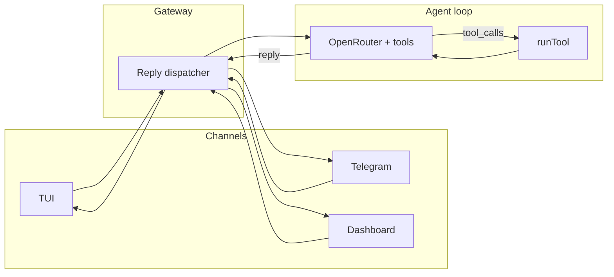

# Rebuilding OpenClaw: Misconceptions, Obstacles, and How It Actually Fits Together

This project has been a ground-up rebuild of OpenClaw in Node.js—Aether-Claw—with no Python and a single runtime. The goal was to keep the same core ideas: a personal AI assistant with tools, memory, skills, and multiple surfaces (TUI, Telegram, web), while making the architecture small enough to hold in your head and modify without reverse-engineering a large codebase.

This article is a map of what I got wrong at first, what was actually hard, and how the pieces really work: config, the agent loop, tools, skills, and the Commander CLI. If you're digging into OpenClaw (or this rebuild) for the first time, I hope it saves you some of that reverse-engineering.

---

## 1. Misconceptions and Obstacles

### "The gateway is a separate service or intent router."

It isn't. In OpenClaw-style design, the "gateway" is **one reply pipeline**. There is no separate classifier LLM that decides "chat vs action vs memory." The flow is: channel (TUI, Telegram, dashboard) → session key → **reply dispatcher** → **agent loop** with full tools. The same `createReplyDispatcher` is used by the daemon, the TUI (in `src/cli.js`), and the dashboard. So "gateway" means this single pipeline—one function that takes a session key and a message body and returns a reply. Not a separate routing service, not a WebSocket server that hands off to something else.

### "Persistence means a separate daemon binary or Python."

Persistence is "one long-lived Node process"—the daemon. On macOS it's a LaunchAgent that runs `aetherclaw daemon` from the install directory. That single process does two things: a **heartbeat loop** (memory index, git scan, skill audit on an interval from config) and the **Telegram poll/reply loop** (getUpdates, then for each message call the same reply dispatcher). No Python, no separate gateway binary. When you run `aetherclaw telegram` by hand, you're running the same dispatcher in a short-lived process; when the daemon runs, it's the same code in a long-lived one.

### "Config is scattered across many files."

It's not. There are two places that matter. **`.env`** holds secrets: `OPENROUTER_API_KEY`, `TELEGRAM_BOT_TOKEN`, `TELEGRAM_CHAT_ID`, and optionally `BRAVE_API_KEY` for web search. **`swarm_config.json`** holds everything else: model routing (which model for reasoning vs action), safety_gate, brain directory, heartbeat interval, cron jobs. Model routing uses two tiers: `tier_1_reasoning` and `tier_2_action`. The agent loop uses the action tier when it runs with tools. Everything else (brain files, skill audit cache, index) is derived or stored under the install directory. See `src/config.js` and `docs/ARCHITECTURE_AND_FEATURES.md` for the exact shape.

### "Skills are plugins that run in a sandbox."

They aren't. Skills are **directories under `skills/` with a `SKILL.md`** (YAML frontmatter plus a body). They don't "run" as separate processes. They're **injected into the system prompt** as an `<available_skills>` block: name, short description, and a path to the SKILL.md file. The model is instructed to use the `read_file` tool to load the relevant SKILL.md when a skill clearly applies. Before any skill is included, it's **audited** (prompt-injection and dangerous-pattern checks); results are cached in `brain/skill_audit_cache.json`. So skills are "prompt extensions"—the model sees the list and can pull in the full instructions when needed. Security is audit plus optional gating (e.g. "this skill requires env X or binary Y"), not process isolation. See `src/openclaw-skills.js` and `src/skill-audit.js`.

### "The agent loop is a single LLM call."

It's iterative. You send: system prompt, conversation history, and the latest user message. You call the LLM with **tools** (the full list) and `tool_choice: 'auto'`. If the response has **no** `tool_calls`, you're done—that's the reply. If it has `tool_calls`, you execute each one via `runTool`, append the results as `role: 'tool'` messages, and call the LLM again with the expanded conversation. You repeat until the model returns a reply with no tool_calls (or you hit max iterations). So one "turn" from the user's point of view can be many LLM calls and many tool runs. The loop lives in `src/agent-loop.js` (`runAgentLoop`, `chatWithTools`).

### "Tools are optional or per-command."

In this rebuild, the **same** tool set (`TOOL_DEFINITIONS`) is sent to OpenRouter on every agent-loop turn. The model chooses which tools to call. There's no "tool profile" switching—one schema, one loop. Exec and file tools are gated by the **safety gate** and **kill switch**; each tool that can do something sensitive calls `checkPermission` in `src/tools/index.js` and can be blocked by config or the kill switch.

### "The CLI is a bunch of ad-hoc scripts."

It's Commander-based (OpenClaw-style): one `program`, global flags like `--no-color`, `--json`, `-V`, and subcommands for each surface. Commands are registered with `.command(...).description(...).action(...)` in `src/cli.js`. So `onboard`, `tui`, `daemon`, `dashboard`, `telegram`, `code`, `ralph`, `status`, `index`, `config get` / `config set`, `doctor`, and `latest` are all subcommands of the same program. The TUI, dashboard, and daemon all use the same reply dispatcher and config; the CLI is the single entrypoint that branches into those flows.

---

## 2. How OpenClaw Actually Works (Core Concepts)

**One reply pipeline.** Every channel (TUI, Telegram, dashboard) ends up calling the same reply dispatcher with a session key. The session key (e.g. `tui`, `telegram:12345`, `dashboard`) determines which conversation history is used. So each channel has its own context, but the code path is one: channel → session key → dispatcher → agent loop.

**Agent loop.** You build a message list: system prompt, optional conversation history (capped), and the latest user message. You call OpenRouter with that list, plus `tools` and `tool_choice: 'auto'`. If the response has `tool_calls`, you run each with `runTool`, append the results as tool messages, and call again. You stop when the model returns only text (no tool_calls) or when you hit the iteration limit.

**Config.** `.env` for secrets; `swarm_config.json` for behavior. `loadConfig` reads the JSON and merges with defaults. Tier selection is by key: e.g. `tier_2_action` for the agent loop. Fallback models (for 429/5xx) can be set per tier in config.

**Tools.** A single array of OpenAI-format function definitions is passed to the API. On the host side, `runTool(workspaceRoot, toolName, args, context)` is a big switch that delegates to the right implementation (exec, read_file, write_file, memory_search, etc.). Many of those implementations call `checkPermission` so the safety gate and kill switch can block dangerous or sensitive actions.

**Skills.** Discovery: find all `skills/*/SKILL.md` directories. Parse each SKILL.md (frontmatter + body). Apply gating from `metadata.openclaw.requires` (bins, env). Run the audit (cached). Eligible skills are formatted into a block and appended to the system prompt; the model is told to read a skill's SKILL.md via `read_file` when it's relevant.

**Commander CLI.** One program, many subcommands. Global flags apply to the whole process. Each command is a subcommand with its own options and action. The daemon, TUI, and dashboard all live behind subcommands and share the same gateway and config, so behavior is consistent across surfaces.

---

## 3. How It All Works Together (Flow)

Here's one concrete path: **the user sends a message in the TUI.**

1. The user types and submits. The TUI is run by the `tui` subcommand in `src/cli.js`. On submit, it calls the same **reply dispatcher** that Telegram and the dashboard use, with a session key like `tui`.

2. The **reply dispatcher** (in `src/gateway.js`) loads config, builds the system prompt (base prompt plus bootstrap context if it's first run, plus the **skills snapshot**), and gets session history for that key. Then it calls **runAgentLoop** with the user message, that system prompt, config, and options (tier, conversation history).

3. The **agent loop** (`src/agent-loop.js`) builds the message array (system, history, user). Then it loops: call **chatWithTools**; if the response has `tool_calls`, run each with **runTool**, append the results, and repeat. It stops when the model returns no tool_calls or when max iterations is reached.

4. **chatWithTools** uses config to resolve the model (e.g. `tier_2_action`) and sends **TOOL_DEFINITIONS** to OpenRouter. The model returns either plain text or a list of tool_calls.

5. **runTool** (`src/tools/index.js`) implements each tool. Some tools call the safety gate; all return a result (string or object) that gets JSON-stringified or passed through and appended as a tool message.

6. The reply dispatcher pushes the user message and the final assistant reply into **session history** for that key, then returns the reply to the TUI (or to Telegram / the dashboard).

Same flow for Telegram or the web dashboard: only the session key and the way the message is delivered change; the pipeline is the same.

---

## 4. Takeaways

- **Single pipeline.** One reply path: dispatcher then agent loop. There aren't separate "chat" and "action" services; the same loop handles everything. Tier and system prompt vary by use case (e.g. the `code` command uses a different system prompt but the same loop).

- **Config is two files.** `.env` plus `swarm_config.json`. Everything else is derived or stored under the install dir (brain, index, skill audit cache).

- **Skills are prompt injection, not plugins.** They're text in the system prompt plus optional `read_file` of SKILL.md. Security is audit and gating, not process isolation.

- **Agent loop is "LLM with tools until done."** There's no separate "plan" phase inside the core loop. The plan-then-build flow (e.g. `aetherclaw code`) is implemented as two phases in the CLI: a planning LLM call, then the build agent loop with the plan in context—not inside the loop itself.

- **Commander unifies the CLI.** One entrypoint, many subcommands. Daemon, TUI, and Telegram all reuse the same gateway and tools; the CLI is just the way you start each mode.

---

## 5. Where to Look in the Repo

- **Config:** `src/config.js`, `docs/ARCHITECTURE_AND_FEATURES.md`
- **Agent loop:** `src/agent-loop.js`
- **Gateway / reply dispatcher:** `src/gateway.js`
- **Tools:** `src/tools/index.js`, `docs/OPENCLAW_TOOLS_AND_WORKFLOWS.md`
- **Skills:** `src/openclaw-skills.js`, `src/skill-audit.js`, `skills/README.md`
- **CLI:** `src/cli.js` (Commander setup and command registration)
- **Daemon:** `src/daemon.js` (heartbeat and Telegram using the same dispatcher)
